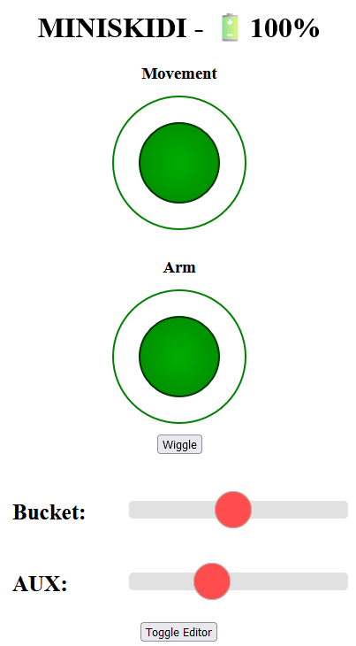
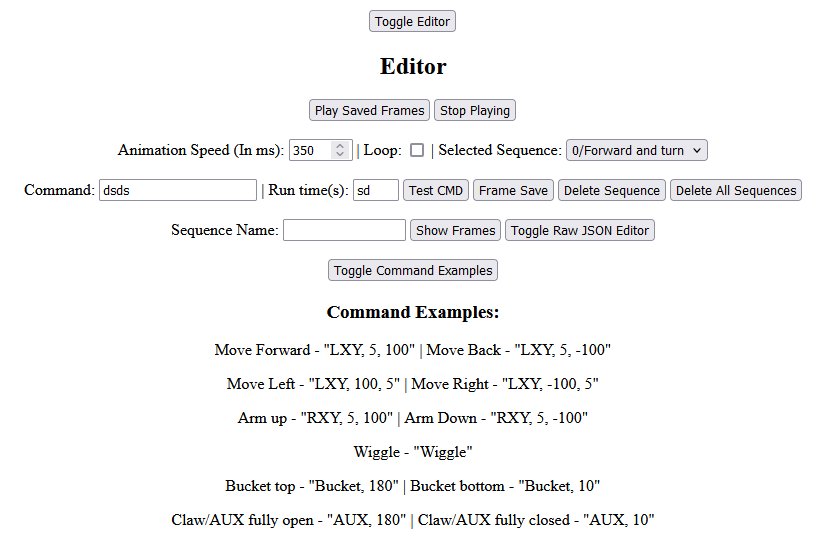

# MiniSkidi_4.0_BL_WIFI
Edited from https://github.com/Le0Michine/MiniSkidi-V4 and https://github.com/ProfBoots/MiniSkidi-V3.0

This is a combination of various parts of the above code to achieve what I wanted, certain things could possibly be done better as i'm no expert.

Has Support for a web interface(using https://github.com/tzapu/WiFiManager for network connection) and a bluetooth controller.

The web interface has been heavily edited including adding on screen joysticks to control movement, movement sequences and battery monitoring(based on two 16340 batteries in series).

The Arduino Sketch has [ElegantOTA](https://github.com/ayushsharma82/ElegantOTA) to update it without plugging it in.

Here are some example movement sequences, the first one is included by default as sequence 0.

 

### Web Interface Pictures

